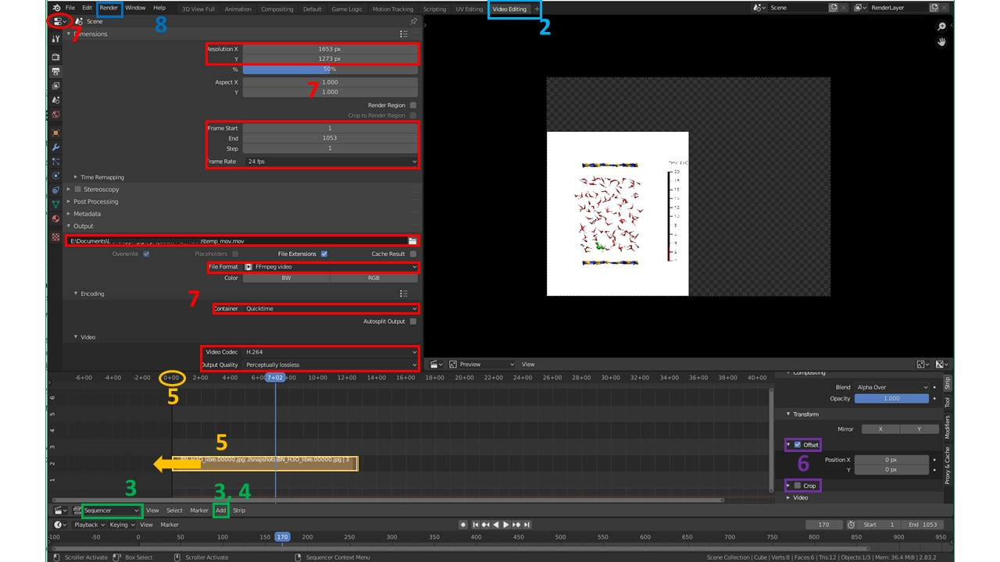

# Protocol to create a molecular dynamics movie using VMD and Blender
 This protocol was used to create  for instance to create videos available [here](https://static-content.springer.com/esm/art%3A10.1038%2Fs41467-019-09708-7/MediaObjects/41467_2019_9708_MOESM4_ESM.mov), [here](https://static-content.springer.com/esm/art%3A10.1038%2Fs41467-019-09708-7/MediaObjects/41467_2019_9708_MOESM5_ESM.mov) and [here](https://static-content.springer.com/esm/art%3A10.1038%2Fs41467-019-09708-7/MediaObjects/41467_2019_9708_MOESM6_ESM.mov).

## Requirements
*  [VMD](https://www.ks.uiuc.edu/Development/Download/download.cgi?PackageName=VMD) (Visual Molecular Dynamics)
*  [Blender](https://www.blender.org/download/) is a free software used for many purposes such as video editing, digital sculpting and painting, animation... Used here to combine images generated by VMD into a movie. Can be used to do further video editing such as simultaneously display several MD trajectories in the same video (split-screen), etc.
*  [netpbm ](http://netpbm.sourceforge.net/) (install on Linux with `apt install netpbm` or `brew install netpbm` on MacOS ): a package that includes **ppmtojpeg**, a line command that transforms ppm images (as generated by VMD) into jpeg images.
*  [display_time_bar](https://github.com/nunolf/pfound/blob/master/lib/pfoundMultimedia1.0/display_time_bar.tcl): a VMD plugin created by Axel Kohlmeyer that displays a time bar during visualization of a MD trajectory. See [here how to install a VMD plugin](https://gist.github.com/tonigi/a9cfaf7642a7fbc13293). 

## Summary
In short this protocol consists of the following steps: 

1. select a MD trajectory file to display
2. create the desired visualization setup in VMD
3.  export trajectory images with VMD
4.  combine the snapshots in Blender


# DETAILED PROTOCOL

## Selecting the trajectory snapshots to be included as video frames. 
1. Choose a number of *frame per second* (FPS) for your final video (e.g. 30)

2. Choose a video length or speed (e.g. 10 seconds or 1 MD picosecond / second)

3. Choose the starting snapshot

4. Determine the MD snapshots to use, depending on the starting and ending MD frames, the chosen FPS and total duration of the final video: 
   $$
   stride = ceil[(last.step-first.step)/(FPS*total.duration)]
   $$
   
5. Modify the display_time_bar arguments accordingly in the plugin script or your VMD script (see below): change the time between 2 snapshots, the time unit and the time between ticks on the time bar. 
   For instance: `display_time_bar 0.5 500 "fs"` (each MD step is 0.5 fs and ticks on the time bar are 500 fs apart)

Because it might be required to launch VMD several times and reading a long trajectory can take time, I prefer to create a new trajectory file with only the necessary snapshots.
I use for instance a small fortran script for XYZ files (see [XYZ_stride.sh](https://github.com/bgrosjea/MD_movie_protocol/blob/master/XYZ_stride.sh) and [XYZ_stride.f90](https://github.com/bgrosjea/MD_movie_protocol/blob/master/XYZ_stride.f90)). 
To use it download both files, place them in the same directory and run 
`./XYZ_stride.sh trajectory_file first_snapshot stride last_snapshot`

For instance: 
`./XYZ_stride.sh traj.xyz 1 10 1000` 
will output a file named `traj_stride_1_10_1000.xyz` containing every 10 steps between 1 and 1000 of the traj.xyz file. 


## VMD script

Because the visualization setup in VMD might require to restart VMD several times I find it most convenient to save all the commands in a .tcl script, with the additional perk to make it easier to create movies afterwards with slight modifications of your own script. I usually use one script per movie I create. 
To run VMD with a script, type in your terminal `vmd trajectory_file -e script.tcl`
If 'vmd' is not a recognized command, make sure the VMD executable or a link to it is in a folder registered in your PATH variable, for instance by creating a symlink:

```bash
ln -s path/to/VMD/executable /directory/in/your/PATH/variable/vmd
```

An example of such a VMD script can be found [here (VMD_movie.tcl)](https://github.com/bgrosjea/MD_movie_protocol/blob/master/VMD_movie.tcl). It contains in particular the command to create the time bar, which **has to be modified to have the right times associated to your MD snapshots**. 

## VMD export options

Once you are pleased by the visualization you obtained, export the images using VMD. Note that the image size is that of your VMD visualization window.  
In the VMD menu go to *Extensions > Visualization > Movie maker*
In Movie maker options, select the following options: 

* *Renderer = Tachyon (Ray Tracer)*
* *Movie Settings = Trajectory*, **uncheck *Delete image files*** 
* *Format =  ppmtompeg (mpeg-1)* or, in newer VMD versions: *MPEG-1(VideoMach)*
* *Set working directory = your/directory/of/choice/ppm*/
* *Rotation angle* = 0
* *Trajectory step size = 1* (if you are working on a trajectory including only the selected snapshots, see above)
* *Movie duration(seconds) *  does not matter as we only want VMD to produce the images, not make the video

Then click on *Make Movie* (the process can be long depending on your GPU, the size of your chemical system and the number of frames you want). 


## Convert ppm images to jpg files
In the directory where the ppm were saved, execute the following command to process all ppm:

```bash
for i in *.ppm
do 
	ppmtojpeg $i >`basename $i .ppm`.jpg
done
```

Move all jpg to an empty directory. 

*Note: in newer versions of VMD, images are exported as .bmp files which you can convert to .ppm using the same script with* bpmtoppm *instead of* ppmtojpeg.

## Combine images in Blender

Please refer to the screenshot below to locate the different objects in the very dense Blender window. 

1. Open the pre-configured file *[blender_default_VMD_movie.blend](https://github.com/bgrosjea/MD_movie_protocol/blob/master/blender_default_VMD_movie.blend)*
2. In the top toolbar, select *Video Editing*. 
3. In the bottom panel select *Sequencer*,  then go click on *Add>Image/Sequence*.
4. In the window that appears, go to the directory where you stored **only** the jpeg images, and press "A" to select all the files, then click on *Add Image Strip*.
5. In the *Sequencer* panel, select and move the strip using your left click, so that the sequence starts at the frame/time 0. 
6. On the right panel, under *Adjust > Transform* tick *Offset*. Below this you have the option to *Crop* the images if desired. **If rendering the video at step 8 displays the error message of "width or height not divisible by 2", crop by steps of 3 pixels until it works.**
7. In the top left corner, select the *Properties* panel, and click on the *Output properties* (the printer icon on the left). Change the *Resolution* to match your images dimensions, adjust the *Frame Start* and *End* depending on where your image strip starts (did you move it to 0 at step 5?) and how many images it contains. Adjust the *Frame Rate* to what you initially choose at the beginning of this whole protocol. Under the *Output* tab, select the filepath for the movie file, *FFmpeg video* as *File Format*. Under the *Encoding* time, select *Quicktime* as *Container*. Finally, under the *Encoding* tab, select *H.264* as *Video Codec* and *Perceptually lossless* as *Output Quality*.
8. To generate the video, in the top toolbar, click on *Render > Render animation* (it takes time depending on your hardware, the images number and resolution). 



*Note: not knowing the first thing about video encoding, I did not take time to ensure Blender keeps the quality of the pristine images when making the video. Please let me know if you have a way to keep the initial resolution of pictures (step 7).*  

# Different time bar style

Example videos ([here](https://static-content.springer.com/esm/art%3A10.1038%2Fs41467-019-09708-7/MediaObjects/41467_2019_9708_MOESM4_ESM.mov), [here](https://static-content.springer.com/esm/art%3A10.1038%2Fs41467-019-09708-7/MediaObjects/41467_2019_9708_MOESM5_ESM.mov) and [here](https://static-content.springer.com/esm/art%3A10.1038%2Fs41467-019-09708-7/MediaObjects/41467_2019_9708_MOESM6_ESM.mov)) used a very slightly different time bar which does not have the thermometer look. To obtain it, replace the relevant lines in the [display_time_bar.tcl](https://github.com/nunolf/pfound/blob/master/lib/pfoundMultimedia1.0/display_time_bar.tcl) script of the plugin by the following code: 

```tcl
#    for {set i 0.0} {$i <= $ylen} \
#        {set i [expr $i + ($delta * $tdelta / $mult)]} {

#        set sy [expr $ysep + $i]
#        graphics $bar color black
#        graphics $bar cylinder [list $xsep [expr $sy - $thgt] $zsep] \
#            [list $xsep [expr $sy + $thgt] $zsep] \
#            radius $radt resolution $cres filled yes
#        graphics $bar color black

#    set c 0
#    for {set i 0.0} {$i <= $ylen} \
#        {set i [expr $i + ($delta * $tdelta / $mult)]} {

#        set sy [expr $ysep + $i]
#        graphics $bar color black
#        graphics $bar cylinder [list $xsep [expr $sy - $thgt] $zsep] \
            [list $xsep [expr $sy + $thgt] $zsep] \
            radius $radt resolution $cres filled yes
#        graphics $bar color black

	#if {[string match fs $unit]} { #<= truc à tester: une décimale si unit = ps, zéro si unit = fs
        #	graphics $bar text [list [expr $xsep + 1.5 * $radt] $sy $zsep] \
        #    	[format "%.0f" [expr $c * $tdelta]]
	#}

	#        graphics $bar text [list [expr $xsep + 1.5 * $radt] $sy $zsep] \
	            [expr $c * $tdelta]
        incr c
    }
```


# In short
1. Based on a desired framerate and video length, determine the MD snapshots to use
2. Export the snapshots with `./XYZ_stride.sh trajectory_file first_snapshot stride last_snapshot`
3. Modify the VMD script until the desired visualization is obtained
4. Export ppm images from VMD
5. Transform ppm images to jpg files
6. Combine jpg files into a video in Blender

